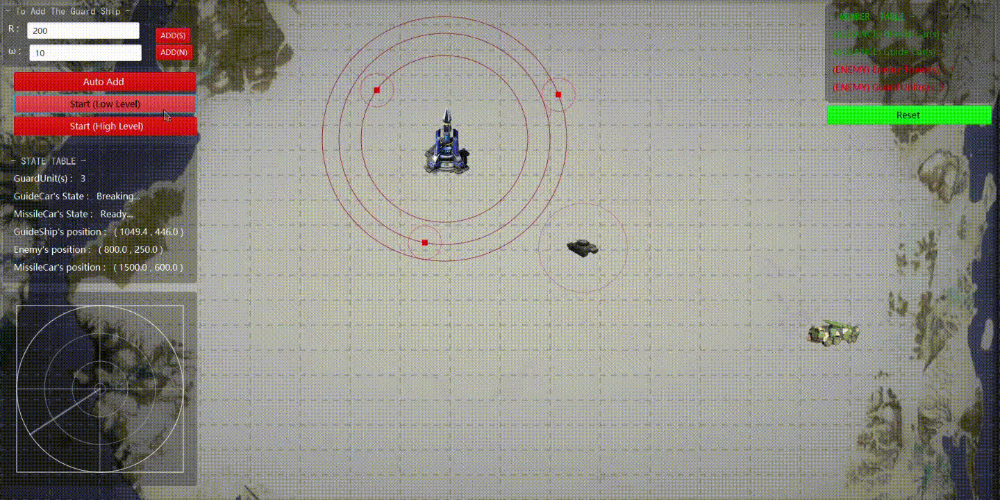

## Simple-Rules-Control Simulation

### 1. Introduction

该 Demo 以红警为原型，使用简单的规则控制探测车突破敌方基地的巡逻守卫并完成弹道引导，最终成功摧毁敌方目标。整个游戏分为防守方和进攻方，防守方包含主要基地和巡逻守卫，玩家可以添加和设置巡逻守卫的分布情况，包括其环绕半径和巡逻速度；进攻方分为引导车和载弹车，引导车需要突破敌方的环绕守卫圈到达敌方基地的周围进行引导，一段时间后载弹车发射导弹摧毁敌方基地。

### 2. Set Guard Units

玩家可以通过左侧的操作界面自己设置环绕守卫的分布，如下图所示。**R**参数代表添加环绕守卫的守卫半径，**w**代表环绕角速度，**按钮ADD(S)** 代表顺时针添加环绕守卫，**按钮ADD(N)** 代表逆时针添加环绕守卫。Demo 中提供了“一键添加”的功能，点击 **Auto Add** 按钮可以一次性添加包含 3 个守卫的守卫阵列。守卫阵列如果在观测范围发现了入侵引导车则游戏结束。

<div align=center></div>

### 3. Start Attack

攻击方主要控制单位为引导车，引导车需要避开敌方环绕守卫，避免被发现，一旦被敌方守卫 catch 到则本次任务失败，该回合结束：

<div align=center></div>

若成功避开巡逻阵列，则进行引导并摧毁敌方基地，该回合结束：

<div align=center></div>

Demo 中基于简单规则对红方引导车做行为控制，由于设定引导车的观测范围是大于敌方护卫的观测范围，因此引导车可以在有敌方护卫靠近的时候选择停止前进来躲避被护卫发现。

### 4. Usage

* 在 IDEA 中 clone 该项目：

```bash
git clone https://github.com/HarderThenHarder/SimpleRulesControlSimulation.git
```

* 运行主程序 **MainUI.java**